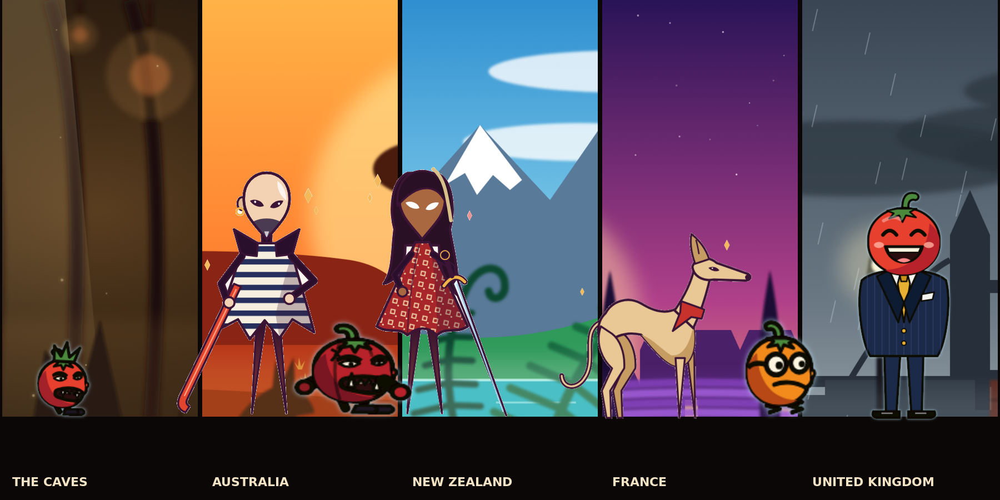

# Charm Adventure in Tomato Land

A fast two-player co-op action platformer. Simon has a crowbar, Charm has a sword, and there are a lot of tomatoes out there.

Written in Rust on Bevy. Early days: five places (the caves, Australia, New Zealand, France, the United Kingdom), three kinds of tomato, a story you can rewrite in the game, and a boss who does not fight yet.



## Install with pip

```
pip install charm-adventure
charm-adventure
```

To update: `pip install --upgrade charm-adventure`. Every change is published to pip automatically. Linux needs glibc 2.35 or newer (Ubuntu 22.04 and later).

## Or download and play

Every change is also built as a plain download. Get the newest build from the [latest release](https://github.com/srlegrand/charm-adventure/releases/latest).

**Windows**
1. Download `charm-adventure-windows.zip` and unzip it.
2. Open the `charm-adventure` folder and double-click `charm_adventure.exe`.
3. If Windows shows "Windows protected your PC", click "More info", then "Run anyway".

**Mac** (Intel and Apple Silicon)
1. Download `charm-adventure-mac.zip` and unzip it.
2. In the `charm-adventure` folder, right-click `charm_adventure`, choose "Open", then "Open" again.
3. If macOS still refuses, open Terminal and run `xattr -dr com.apple.quarantine ~/Downloads/charm-adventure`, then try again.

**Linux and Steam Deck** (Desktop Mode)
```
tar xzf charm-adventure-linux.tar.gz
cd charm-adventure && ./charm_adventure
```

Keep the `assets` folder next to the game; it will not start without it.

## Controls

| Action | Controller | Keyboard and mouse |
|---|---|---|
| Move | Left stick / D-pad | Arrows / WASD |
| Jump | A | Space / Z |
| Attack (hold up or down to aim) | X | X / J / left click |
| Dash (hold to sprint) | Right trigger | C / K / Left Shift / right click |
| Send 10 flowers to your partner as a heart | B | G / Q |
| Character and player menu | View / Select | Tab |
| Split screen on and off | | F2 |
| Story editor | | F1 |
| Show collision shapes, frame rate | | F3 |
| Restart, fullscreen, quit | | R, F11, Esc |

## Two players

Pick "2 PLAYERS" in the menu. With one controller, the keyboard is player 1 and the controller is player 2. With two controllers, each player gets one. The screen splits down the middle; F2 switches to one shared camera.

Kill tomatoes to collect flowers into your bouquet. Send ten flowers to your partner and they become a heart: one life for them. You cannot make hearts for yourself. A player with no lives left goes down until their partner sends them a heart.

## Make it yours

Everything is plain text and reloads while the game runs:

- `assets/config/tuning.ron`: player and tomato speeds, jumps, attacks, health.
- `assets/levels/*.ron`: platforms, thorns, where tomatoes start, where the door leads.
- `assets/story/*.ron`: who says what, and when.
- `assets/themes/*.ron`: the colours and backdrop of each place.

## Tell your own story

Press F1 in a game. Each place has a page of scenes. A scene is a card: when it starts, who says what, and the choices the players get. A choice can lead to another scene or to another place, so the choices decide the route. Click any text to change it. PLAY on a card jumps into the game at that scene. Everything is saved as you go.

## Build from source

Install [Rust](https://rustup.rs), then:

```
cargo run --release
```

On Linux, first install the build libraries:

```
sudo apt install libasound2-dev libudev-dev libwayland-dev libxkbcommon-dev
```

## Layout

- `src/sim.rs`: the gameplay simulation. It takes button presses and nothing else, so two machines can stay in step.
- `src/main.rs`: window, input, drawing, effects, speech.
- `src/editor.rs`: the story editor.
- `design/`: the scripts that draw the art. `design/concept.py` draws the picture at the top of this page.
- `packaging/wheel.py`: packs a build into a pip wheel.
